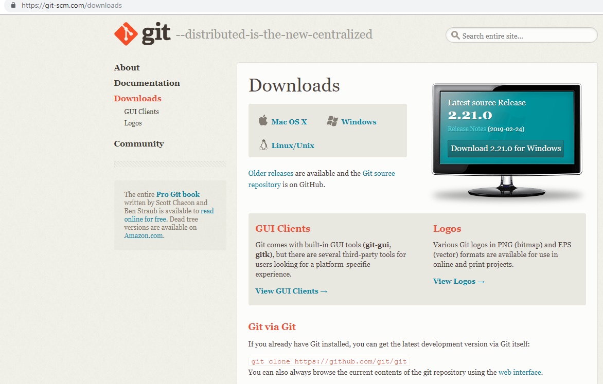
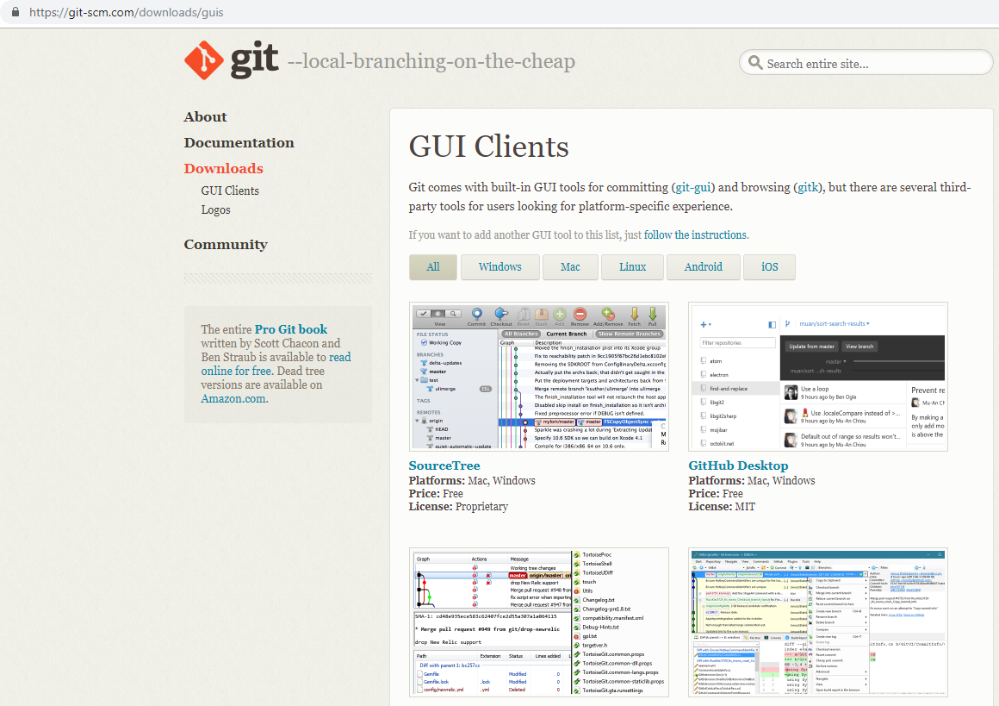
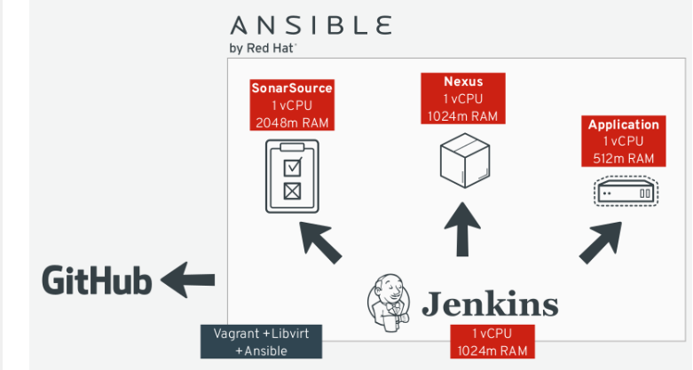

# Basic  Git

---

## What is git? 

---

- Git is a distributed version-control system for tracking changes in source code during software development. It is designed for coordinating work among programmers, but it can be used to track changes in any set of files. Its goals include speed, data integrity, and support for distributed, non-linear workflows. Wikipedia

---

---

---

- git-init - Create an empty Git repository or reinitialize an existing one

---

- git-add - Add file contents to the index

---

- git-commit - Record changes to the repository

---

- git-push - Update remote refs along with associated objects

---

<<<<<<< HEAD

---

## Questions?

---

## Thank you!
=======
# Questions?

---

# Thank you!
>>>>>>> 3eec3055031a0f41c69dafc2ba001718ff6f5657
